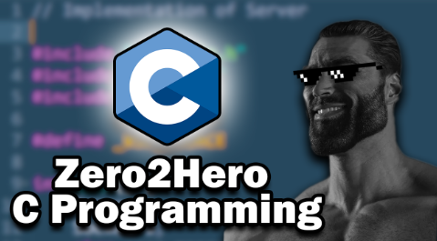

# C From Zero to Hero final project

  

This is the implementation of the final project of the course "C from Zero to Hero" from [Low Level Academy](https://lowlevel.academy/), which I really recommend if you are looking to learn some C programming 😉.

The utility is called `dbview` which simulates the functionality of a simple database.

To compile the utility run `make compile` on the terminal.

Parameters of `dbview`:

* `-n`: flag to create a new `.db` file.
* `-f <filepath>`: Path to `.db` file to read or create.
* `-a <name,adress,hours>`: Add a new employee to the ddbb, string should be provided bewtween double quotes, e.g. "Timmy, 123 shout street,40".
* `-l`: flag to list all employees on `.db` file.
* `-r <name>`: Remove employee from ddbb given his/her name.
* `-u <name,hours>`: Update the hours of the employee on the ddbb based on his/her name.

You can run an example with the command `make example`.